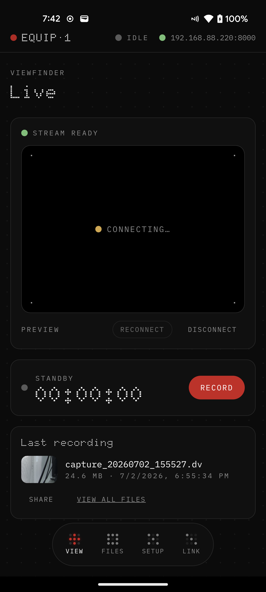
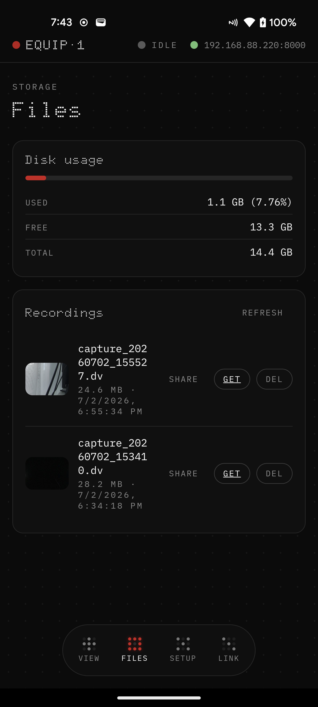
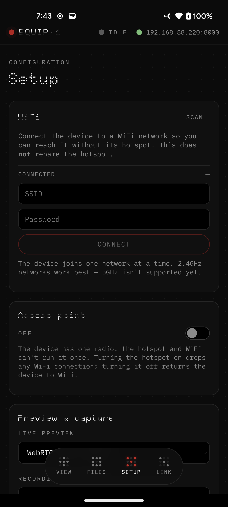
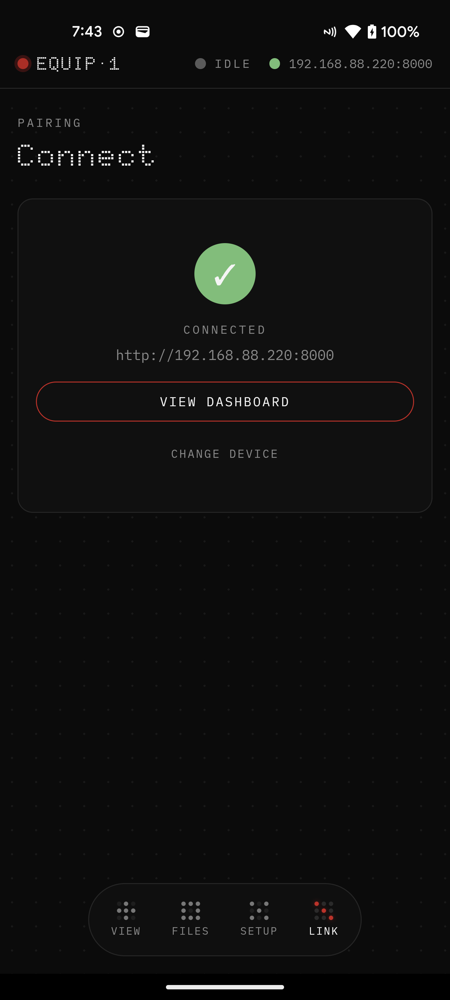

# equip-1

compact dv recorder. connects to any firewire camcorder and saves footage
directly to microsd. no laptop required. you control it from an android app —
live preview, one-tap record, and browse or download what you captured.

supports minidv, dvcam, dvcpro, digital8, and hdv. controls the tape deck on
supported cameras, so you can digitize an entire tape automatically. pressing
record on the camera triggers capture on the equip-1.

built around the [radxa rock 2f](https://radxa.com/products/rock2/2f/) and our
custom **firehat** — a firewire hat with a via vt6315n controller connected over
pcie via fpc. the firehat is also available standalone; it works as a hat for the
rock 2f, pi 5 and other sbcs.

> **v0.1** — first tagged release. the device records, streams a live preview,
> and is fully controllable from the phone. see [status](#status) for exactly
> what works today and what is still rough.

## what it does

- capture dv/hdv over firewire straight to microsd, lossless `.dv`
- live preview on your phone — webrtc for low latency, mjpeg as a fallback
- start and stop recording remotely; auto-trigger from the camera's record button
- browse, download, share and delete recordings from the app
- pair over bluetooth, then reach the device three ways: over your wifi, over
  ethernet, or over the device's own wifi hotspot
- switch the device between hotspot and a wifi network from the app, no cable
- runs a mainline-kernel yocto image; the whole stack is open source

## the app

android app built with react + capacitor. four screens: live viewfinder, files,
setup, and pairing.

<p align="center">
  
  
  
  
</p>

## status

verified on a radxa rock 2f (rk3528a), mainline kernel 6.18, image built from the
[meta-firewire-recorder](https://github.com/g8row/meta-firewire-recorder) `wrynose`
layer.

works today:

- dv capture to microsd, lossless `.dv` files
- live preview over webrtc/whep and over mjpeg
- remote record start/stop, with the record button disabled (and a reason shown)
  when a capture would just fail — device unreachable, no camera, or low space
- file listing with thumbnails, download, native share, and delete
- bluetooth pairing and device status over ble
- device wifi hotspot (wpa3), phone joins it as a saved network in one tap
- joining the device to a 2.4ghz wifi network, and switching hotspot ↔ wifi
  from the app without re-pairing
- lan auto-discovery seeded from the phone's own subnet

rough edges / not yet:

- **5ghz wifi** as a client is not supported — the aic8800 radio's 5ghz
  association is rejected by the driver/firmware, so only 2.4ghz networks
  provision reliably. dual-band ssids that expose 5ghz will fail to join.
- **bluetooth advertising** uses a legacy fallback: the combo chip reports
  bluetooth 5.4 but its extended advertising doesn't transmit, so the app scans
  by device name (`equip-1`) rather than by service uuid. the real fix is a
  kernel quirk patch on the bsp side.
- **hardware h.264 encoding** isn't available on the rk3528 in mainline (no
  encoder driver), so the live preview is encoded in software (libx264). capture
  itself is lossless dv and unaffected.
- the live preview shows a picture only while the camcorder is actually
  transmitting dv frames (playing a tape or in camera mode). an idle deck shows
  a connected-but-waiting viewfinder.

## downloads

- **android app** — grab the apk from the
  [latest release](https://github.com/g8row/equip-1/releases/latest) and sideload
  it. android will warn about an unknown source; that's expected for a sideloaded
  build.
- **prebuilt device image** — a ready-to-flash yocto image is published on the
  [meta-firewire-recorder releases](https://github.com/g8row/meta-firewire-recorder/releases/latest).
  write it to a microsd card (e.g. with balenaetcher or `dd`) and boot the rock 2f
  from it.
- **build from source** — see [building](#building).

## hardware

**equip-1**

- radxa rock 2f (rockchip rk3528a, quad-core arm cortex-a53, 2 gb ram, 8 gb emmc)
- firehat (see below)
- microsd storage
- usb-c power input, 5v
- hdmi output
- wifi 6, bluetooth 5.4 (aic8800d80, single shared radio)
- 2x usb 2.0 type-a
- 60 mm x 70 mm x 25 mm, ~100 g

**firehat**

- via vt6315n firewire controller
- 6-pin firewire port (dv in)
- pcie 2.0 x1 via fpc connector
- 40-pin 2.54 mm gpio header (raspberry pi-compatible)
- oled display
- 3x smd buttons, rgb led, buzzer
- 56 mm x 70 mm x 12 mm, ~25 g

## how it fits together

```
firewire camcorder ──(dv over ieee-1394)──▶ firehat (vt6315n) ──pcie──▶ rock 2f
                                                                           │
   android app ◀──── http / webrtc / ble ────────────────────────────────┘
                     companion-api (:8000)  +  companion-net (ble/wifi)
```

- **companion-api** — http server on `:8000`. manages dvgrab/ffmpeg capture,
  the mediamtx lifecycle, the webrtc/mjpeg preview, file listing, and serves the
  web ui.
- **companion-net** — ble gatt server plus connman wifi/hotspot control.
  advertises the device for pairing and accepts wifi credentials.
- **mediamtx** — bundled rtsp/webrtc relay that re-publishes the capture as a
  whep endpoint for the app.

## repositories

- **this repo** ([g8row/equip-1](https://github.com/g8row/equip-1)) — firehat
  hardware, the companion app and server (`companion/`), and the os sources.
- **[g8row/meta-firewire-recorder](https://github.com/g8row/meta-firewire-recorder)**
  — the yocto meta-layer that builds the device image.

layout:

```
equip-1/
  companion/        the recorder software
    server/         two go binaries (companion-api, companion-net)
    web/            react + capacitor app (android)
    deploy/         board deployment bits
  design/           firehat hardware + media
  src/os/           os sources
```

## building

**app + server** (from `companion/`):

```sh
cd companion/web && npm install && npm run build   # web ui
cd ../server && GOOS=linux GOARCH=arm64 CGO_ENABLED=0 go build ./cmd/companion-api
```

the react ui is embedded into `companion-api` at build time. for the android app,
`npx cap sync android && ./gradlew assembleDebug` from `companion/web`.

**device image** — see
[meta-firewire-recorder](https://github.com/g8row/meta-firewire-recorder).

## open source

hardware is licensed under [cern-ohl-s](https://ohwr.org/cern_ohl_s_v2.txt).
software is licensed under gpl. derivatives must be released under the same
licenses.

## community

discord: [discord.gg/wpXmcb5mvK](https://discord.gg/wpXmcb5mvK)

if you like this project and want to know more about the development and future
steps, or even build your own version, feel free to join. we are a small
community building objects with computers.
